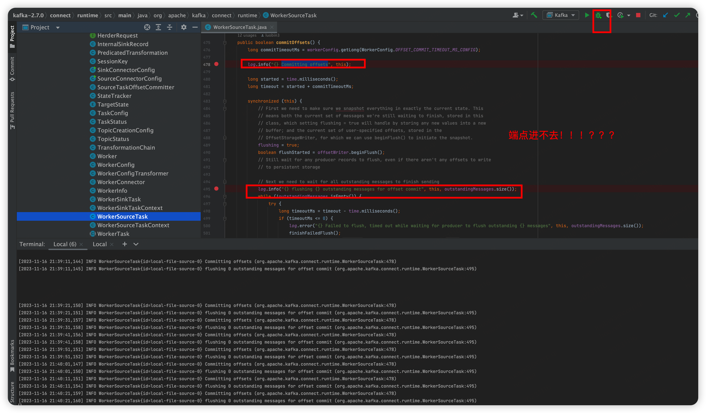

# kafka 本地调试

- [kafka 本地调试](#kafka-本地调试)
  - [基础环境](#基础环境)
  - [代码构建](#代码构建)
  - [运行](#运行)
    - [常见错误](#常见错误)
    - [成功](#成功)
    - [验证](#验证)
  - [connector环境](#connector环境)
    - [关闭](#关闭)
    - [重启](#重启)
    - [加断点](#加断点)
      - [将file包四个文件复制到runtime包中，可以调试](#将file包四个文件复制到runtime包中可以调试)
    - [日志](#日志)
  - [文件连接器调试](#文件连接器调试)


[聊聊 Kafka：编译 Kafka 源码并搭建源码环境](https://xie.infoq.cn/article/6fd06714623437ebed2f43a47)

## 基础环境
+ 本地如果装了多个jdk，通过jenv切到jdk8
+ 并去idea配置中，确保都是jdk8
+ 启动hello-docker环境

  

## 代码构建
+ 耗时5min左右

```
./gradlew clean build -x test
```

  


## 运行


### 常见错误
+ 指定JAVA_HOME为jdk8路径
+ 查看zk是否启动了,并且9092端口是否被占用了
+ 查看配置中ip地址是否正确
+ kafka-logsw文件夹删掉


  

### 成功
  

### 验证
```
cd bin
./kafka-topics.sh --zookeeper 192.168.12.159:2181 --create --topic topic_test --partitions 1 --replication-factor 1
```

  
  


## connector环境
+ 创建文件夹~/kafka-source-logs

```
# 写入数据
npm run source-input
```

  
  
  

### 关闭
+ idea的kafka关掉
+ connector-start的命令行关闭
+ 清理npm run clear
+ 重启npm run restart，因为topic注册到zk上去了

### 重启
+ 直接运行idea的kafka调试按钮


### 加断点
+ 因为kafka和connector是两个程序，之前启动connector不是idea起的！！！
  

  
  

#### 将file包四个文件复制到runtime包中，可以调试

  

### 日志

  


## 文件连接器调试
[参见代码仓库](https://gitee.com/wangy202012/spring-source-learning/blob/master/doc/kafka-connector.md)