# kafka-connect-zeebe

- [kafka-connect-zeebe](#kafka-connect-zeebe)
  - [启动docker](#启动docker)
  - [启动源码](#启动源码)
  - [关闭](#关闭)
  - [connector运行成功](#connector运行成功)
  - [部署bpmn](#部署bpmn)
  - [完整部署流程](#完整部署流程)
    - [清理](#清理)
    - [启动docker](#启动docker-1)
      - [验证](#验证)
    - [启动kafka和connector](#启动kafka和connector)
      - [验证](#验证-1)
    - [modeler部署bpmn](#modeler部署bpmn)


## 启动docker
+ npm run start

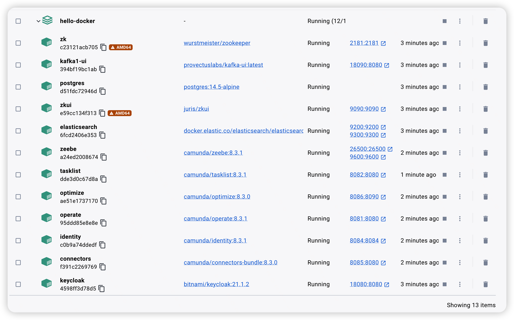  


## 启动源码
+ https://github.com/robin2017/kafka-2.7.0/tree/dev-connector-zeebe


## 关闭
```
关掉kafka和connector
npm run clear
npm run restart
```

## connector运行成功

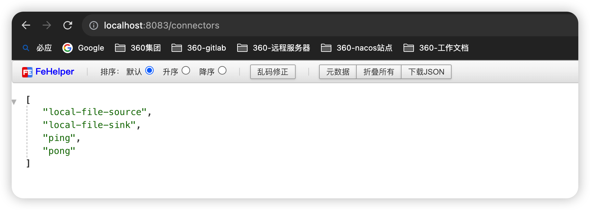  

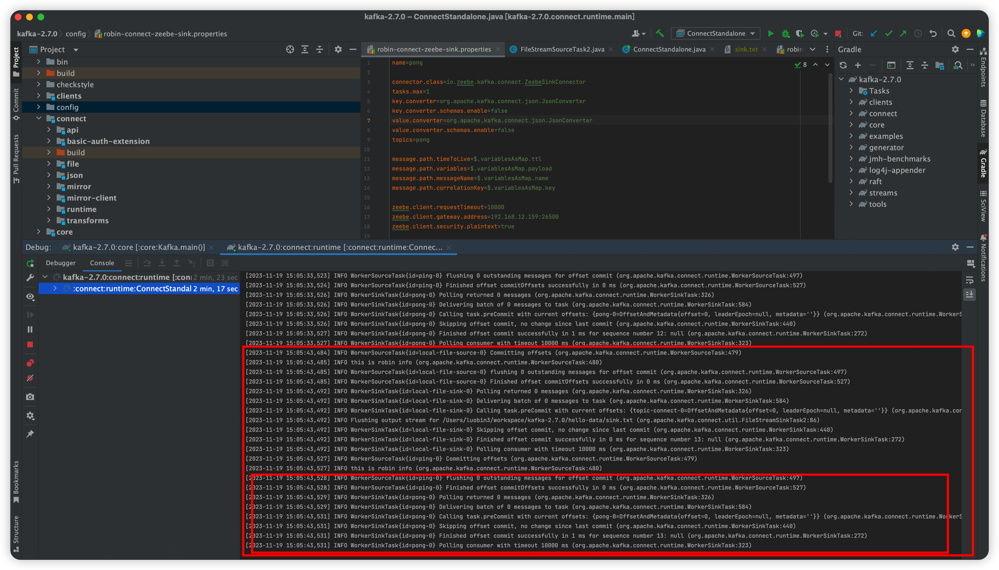  


## 部署bpmn
+ 使用modeler部署，很方便
+ 但是在kafka-ui上看不到broker和topic！！！？？？

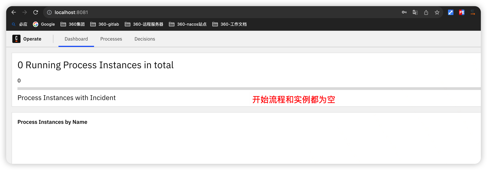  

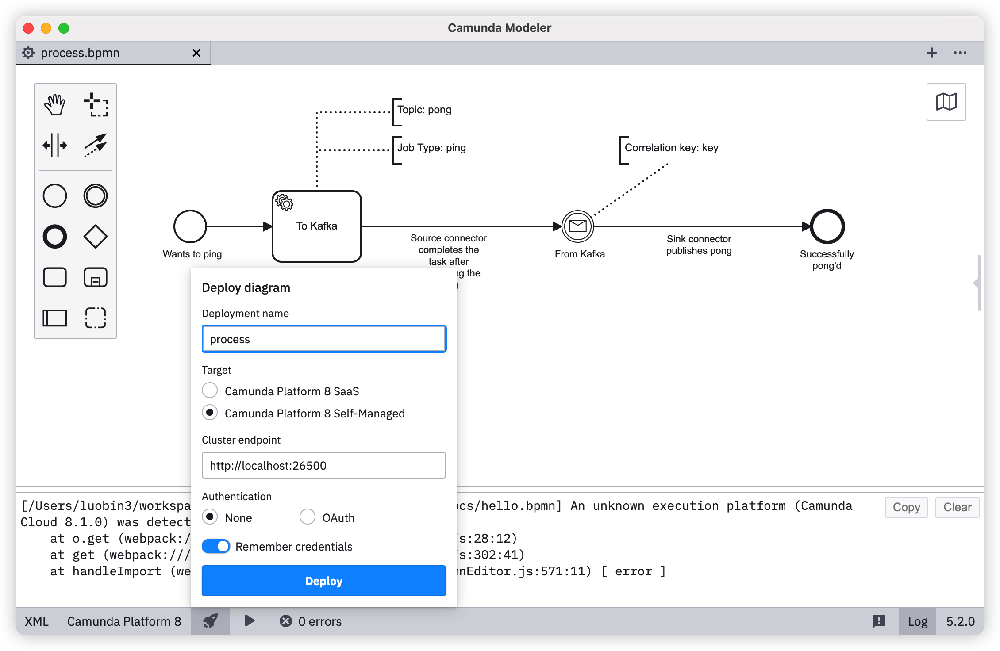  
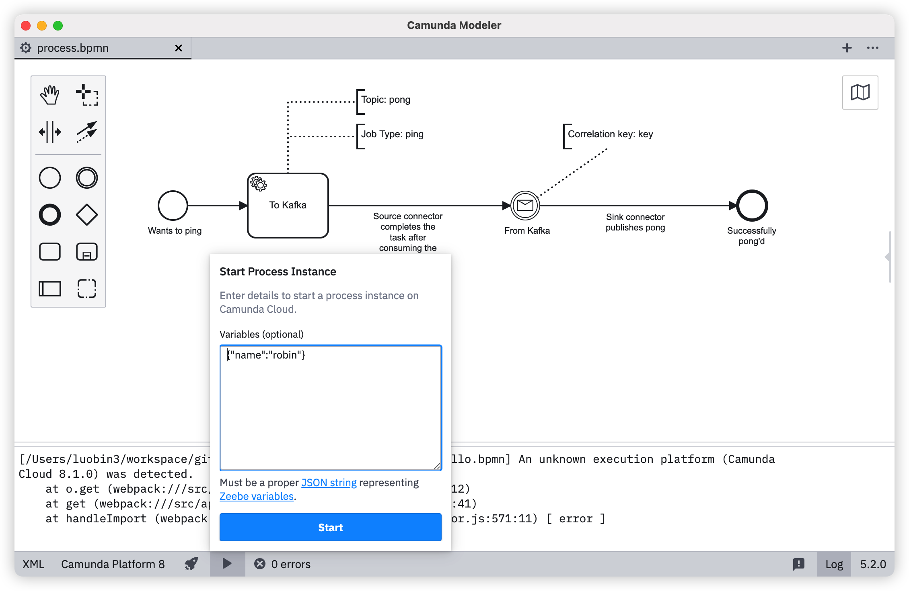  
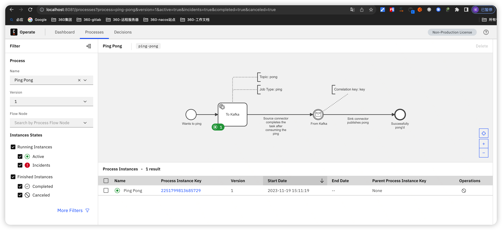  
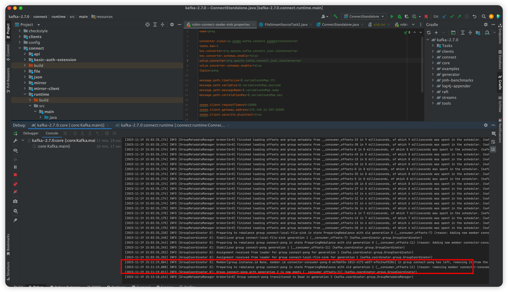  


## 完整部署流程
### 清理
+ docker的容器和volumn都清理干净
+ 清理kafka-logs：npm run clear
+ 查看ip，所有kafka-2.7.0整个项目的ip

### 启动docker
+ npm run start

#### 验证
+ 查看zeebe是否成功


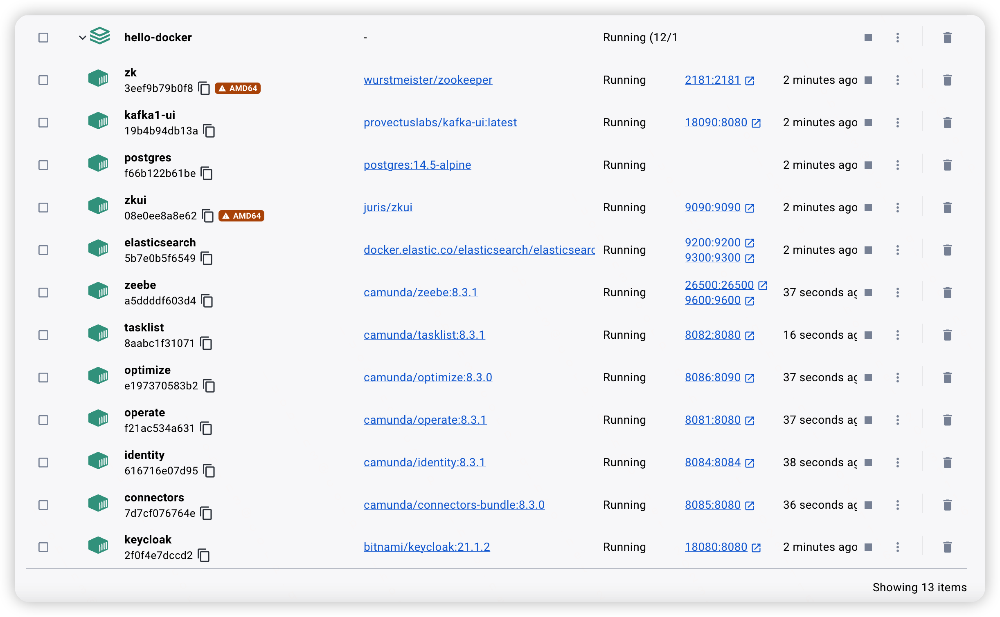  
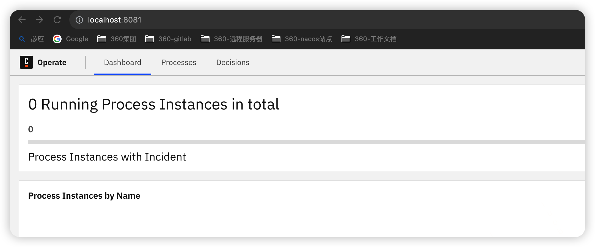  


### 启动kafka和connector
+ 按照顺序启动akfka和connector

#### 验证
+ 查看两个服务是否启动成功
+ 通过kafka-ui查看broker和topic信息


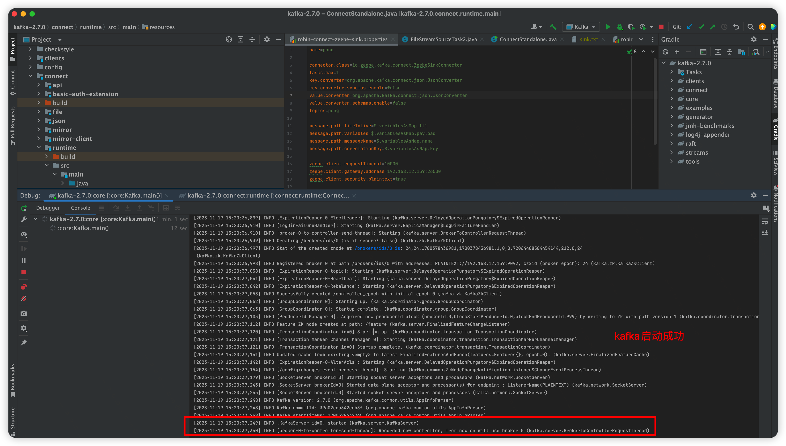  
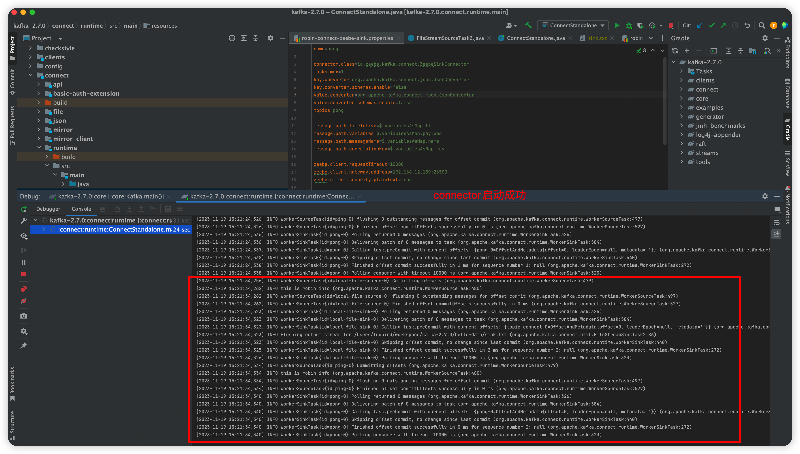  
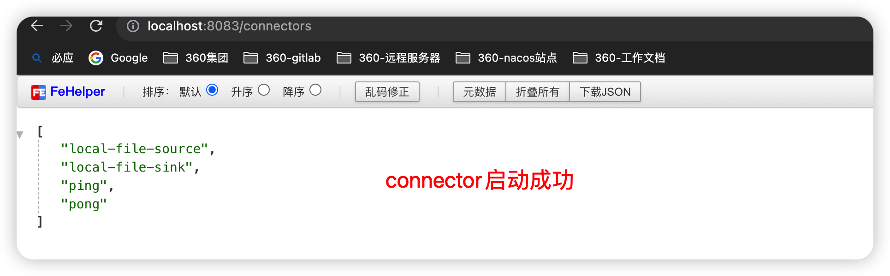  
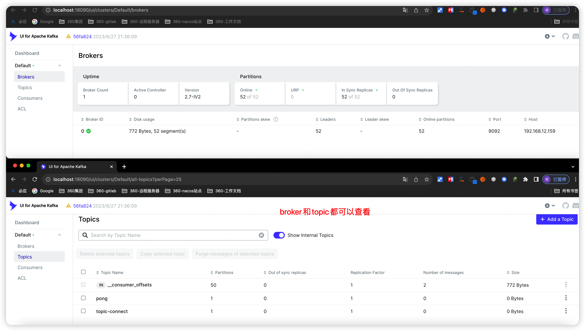  


### modeler部署bpmn
+ bpmn文件在hello-data目录下

